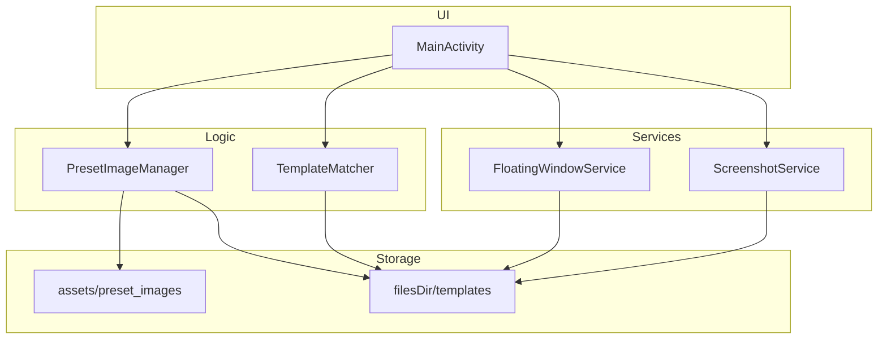
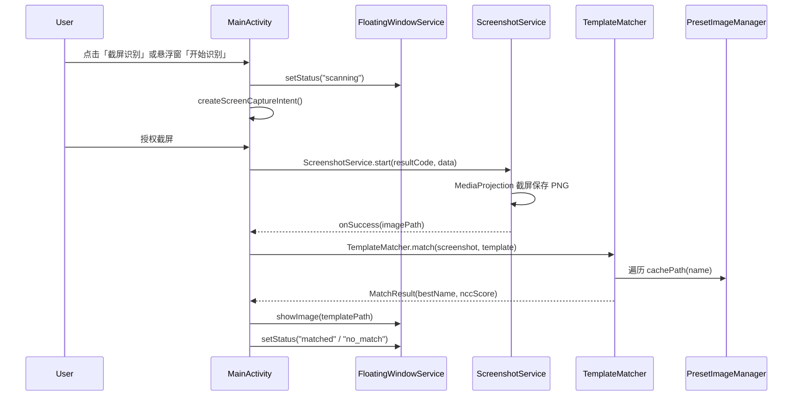
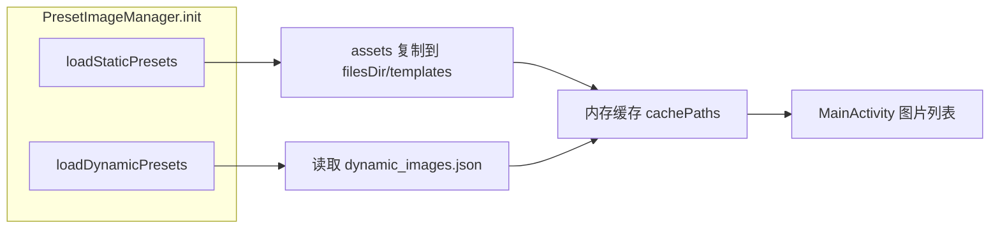

# 系统架构文档

## 概述

截图识别工具（Screen Matcher）是一款 Android 应用，用于对屏幕进行截图，并将截图与本地预置的模板图片进行模板匹配识别。它使游戏玩家能够在迷宫类游戏中快速识别屏幕中出现的「门」图案，从而判断当前所处位置或选择正确的行进方向。

系统将 29 张预置的「门」图案图片打包在 APK 的 assets 目录中，也支持用户通过文件选择器动态添加自定义模板。用户启动悬浮窗服务后，可以随时触发一次屏幕截图，应用会对截图执行多尺度归一化互相关（NCC）模板匹配，并在悬浮窗中展示命中的模板图片与匹配状态。

系统由 5 个核心 Kotlin 组件组成：主界面（MainActivity）、悬浮窗前台服务（FloatingWindowService）、截屏前台服务（ScreenshotService）、模板匹配引擎（TemplateMatcher）以及预置图片管理（PresetImageManager）。三个前台组件相互协作完成「触发识别 -> 截屏 -> 匹配 -> 展示结果」的完整链路。

## 技术栈

**语言与运行时**
- Kotlin 1.9.22
- Java 17（JVM Target）

**框架**
- Android Gradle Plugin 8.2.0
- Jetpack AppCompat、RecyclerView、CardView
- Material Components（Material Design 主题）
- androidx.core (core-ktx)

**构建工具**
- Gradle 8.5（Wrapper）
- Min SDK 21，Target SDK 34，Compile SDK 34

**CI/CD**
- GitHub Actions（`.github/workflows/build-apk.yml`）
- 产物发布到 GitHub Release

**脚本工具**
- Python 3（`scripts/monitor_build.py`，构建监控）

## 项目结构

```
HPC/
├── app/
│   ├── build.gradle.kts        # 应用模块构建配置
│   └── src/main/
│       ├── AndroidManifest.xml  # 应用清单（权限、组件声明）
│       ├── assets/preset_images/# 29 张预置门图案 + manifest.json
│       ├── kotlin/com/example/screen_matcher/
│       │   ├── MainActivity.kt          # 主界面
│       │   ├── FloatingWindowService.kt # 悬浮窗前台服务
│       │   ├── ScreenshotService.kt     # 截屏前台服务
│       │   ├── TemplateMatcher.kt       # NCC 模板匹配引擎
│       │   └── PresetImageManager.kt    # 预置图片管理
│       └── res/                 # 布局、图标、矢量图资源
├── .github/workflows/
│   └── build-apk.yml           # CI 构建与发布工作流
├── gradle/
│   └── wrapper/                # Gradle Wrapper
├── build.gradle.kts            # 根构建配置
├── settings.gradle.kts         # 工程与仓库配置
├── gradle.properties           # Gradle JVM 参数
└── scripts/                    # 构建监控脚本（fb）
```

**入口点**
- `MainActivity.kt` - 应用启动入口（LAUNCHER Activity）
- `FloatingWindowService.kt` - 悬浮窗服务入口
- `ScreenshotService.kt` - 截屏服务入口

## 子系统

### MainActivity（主界面）

**目的**: 应用入口，展示预置图片列表，管理悬浮窗与截屏识别的触发
**位置**: `app/src/main/kotlin/com/example/screen_matcher/MainActivity.kt`
**关键文件**: `MainActivity.kt`, `res/layout/activity_main.xml`, `res/layout/item_image.xml`
**依赖**: PresetImageManager, TemplateMatcher, FloatingWindowService, ScreenshotService
**被依赖**: 无（入口 Activity）

### FloatingWindowService（悬浮窗前台服务）

**目的**: 以悬浮窗形式常驻显示识别状态与匹配结果，提供「开始识别」按钮
**位置**: `app/src/main/kotlin/com/example/screen_matcher/FloatingWindowService.kt`
**关键文件**: `FloatingWindowService.kt`, `res/layout/floating_window.xml`
**依赖**: 无（通过伴生对象静态方法被 MainActivity 调用）
**被依赖**: MainActivity（调用 `setStatus`/`showImage`/`hideImage`）

### ScreenshotService（截屏前台服务）

**目的**: 通过 MediaProjection 对屏幕截图并保存为 PNG，通过回调返回图片路径
**位置**: `app/src/main/kotlin/com/example/screen_matcher/ScreenshotService.kt`
**关键文件**: `ScreenshotService.kt`
**依赖**: MediaProjection API, ImageReader
**被依赖**: MainActivity（`ScreenshotService.start`）

### TemplateMatcher（模板匹配引擎）

**目的**: 对截图与模板执行多尺度 NCC 模板匹配，返回匹配分数与位置
**位置**: `app/src/main/kotlin/com/example/screen_matcher/TemplateMatcher.kt`
**关键文件**: `TemplateMatcher.kt`
**依赖**: Android Bitmap API
**被依赖**: MainActivity（`TemplateMatcher.match`）

### PresetImageManager（预置图片管理）

**目的**: 管理预置图片：从 assets 复制静态图片到应用目录，维护用户动态添加的图片
**位置**: `app/src/main/kotlin/com/example/screen_matcher/PresetImageManager.kt`
**关键文件**: `PresetImageManager.kt`, `assets/preset_images/manifest.json`
**依赖**: Android assets, Context 文件系统
**被依赖**: MainActivity

## 图表

### 系统组件架构



### 截屏识别时序图



### 图片加载数据流



## 关键流程

### 悬浮窗启停流程

1. 用户点击「启动悬浮窗」按钮
2. 检查悬浮窗权限（`Settings.canDrawOverlays`），未授权则跳转授权页
3. 授权后以前台服务方式启动 `FloatingWindowService`，创建通知渠道与前台通知
4. 服务在 `onCreate` 中通过 `WindowManager.addView` 创建悬浮窗视图
5. 再次点击按钮则停止服务并清除回调引用

### 识别流程

1. 触发识别（主界面按钮或悬浮窗按钮，回调 `onStartRecognition`）
2. 检查识别中状态与图片列表非空
3. 通过 MediaProjection 请求截屏权限
4. 启动 `ScreenshotService` 截屏保存 PNG
5. 回调返回图片路径后，在后台线程遍历所有模板执行 NCC 匹配
6. 取最高分模板，若分数超过阈值（0.45）则显示匹配图片，否则显示未匹配
7. 删除临时截图文件，恢复空闲状态

## 设计决策

### 前台服务保证后台截屏与悬浮窗

截屏（mediaProjection）与悬浮窗（overlay）在后台运行时受 Android 系统限制，两者都实现为前台服务并声明对应的 `foregroundServiceType`（`mediaProjection` / `specialUse`），确保系统不回收。

### 多尺度 NCC 模板匹配

模板在截图中的实际大小未知，TemplateMatcher 以 8 档缩放比例（0.35 至 1.8）对模板缩放后，在缩放至 600px 宽的截图上做粗扫描（步长 6px、阈值 0.35），对候选位置计算精确 NCC，取最高分。匹配阈值 `NCC_THRESHOLD = 0.45`。

### 静态预置 + 动态用户图片

预置图片打包进 assets 并首次启动复制到应用私有目录，避免运行时 IO 权限问题；用户添加的图片与动态清单（`dynamic_images.json`）一起持久化，删除时同步移除。

### GitHub Actions 自动构建发布

每次 push 到 `master` 自动构建 debug 与 release APK，release 使用 debug 签名便于直接安装，两个产物同时上传到 Artifacts 并发布到 GitHub Release。
