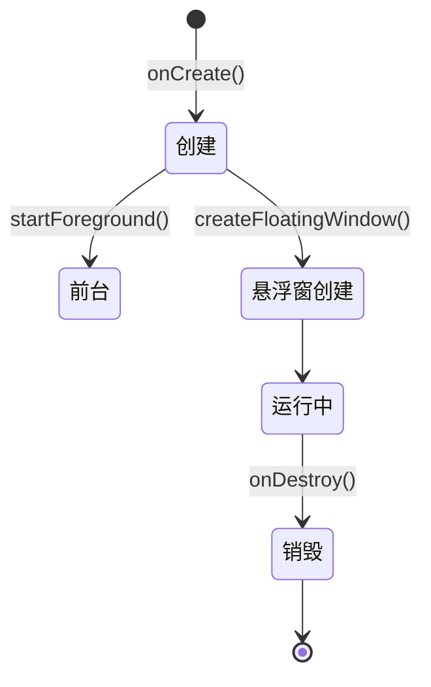

# 悬浮窗服务

悬浮窗服务是本应用与用户实时交互的常驻界面。

## 什么是悬浮窗服务？

悬浮窗服务（FloatingWindowService）是一个前台服务，通过 WindowManager 在其他应用之上显示一个小型悬浮窗。它实时展示识别状态（正在识别中、已匹配、未找到匹配）、提供「开始识别」按钮入口，并在匹配成功后展示命中的门图案图片。

**关键特征**:
- 前台服务：带通知常驻，声明 `specialUse` 前台服务类型
- 静态调用：通过伴生对象静态方法暴露 `showImage` / `hideImage` / `setStatus`
- 回调注入：`onStartRecognition` 回调由 MainActivity 注入，实现悬浮窗按钮触发识别
- 可拖拽：通过拖拽手柄（`drag_handle`）在屏幕上移动

## 代码位置

| 方面 | 位置 |
|------|------|
| 服务 | `app/src/main/kotlin/com/example/screen_matcher/FloatingWindowService.kt` |
| 悬浮窗布局 | `app/src/main/res/layout/floating_window.xml` |
| 背景样式 | `app/src/main/res/drawable/floating_window_bg.xml`、`drag_handle_bg.xml` |
| Manifest 声明 | `app/src/main/AndroidManifest.xml` |

## 不变量

1. **主线程更新**: 所有 UI 状态通过 `mainHandler.post` 在 UI 线程执行
2. **权限前置**: 需先授予悬浮窗权限（`Settings.canDrawOverlays`）才能启动
3. **前台通知**: 启动时必调用 `startForeground`，通知渠道 `screen_matcher_floating`

## 生命周期

### 状态描述

| 状态 | 描述 |
|------|------|
| `创建` | 初始化伴生对象实例与通知 |
| `前台` | 以 `specialUse` 类型进入前台 |
| `悬浮窗创建` | inflate 布局并 `addView` 到 WindowManager |
| `运行中` | 响应识别状态更新、拖拽与按钮点击 |
| `销毁` | 移除悬浮窗视图并清空实例 |

## 状态文字

| 状态码 | 显示文字 |
|--------|---------|
| `scanning` | 正在识别中... |
| `matched` | 已匹配 |
| `no_match` | 未找到匹配 |
| `idle` | 点击开始识别 |
| 其他 | 原样显示 |
