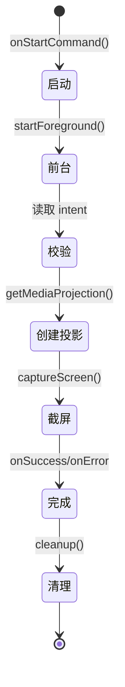

# 截屏服务

截屏服务负责捕获当前屏幕内容并保存为图片文件，是识别链路的输入来源。

## 什么是截屏服务？

截屏服务（ScreenshotService）是一个前台服务，通过 MediaProjection API 创建虚拟显示（VirtualDisplay）来捕获整个屏幕，将首帧 RGBA 图像转换为 PNG 保存到应用缓存目录，并通过回调把文件路径返回给调用方（MainActivity）。

**关键特征**:
- 前台服务：声明 `mediaProjection` 前台服务类型，确保截屏期间不被回收
- 单帧捕获：`ImageReader.acquireLatestImage` 取最新一帧后立即清理并停止服务
- 一次即停：服务执行一次截图后 `stopSelf()`，返回 `START_NOT_STICKY`
- 回调驱动：结果通过静态回调 `ScreenshotCallback` 返回

## 代码位置

| 方面 | 位置 |
|------|------|
| 服务 | `app/src/main/kotlin/com/example/screen_matcher/ScreenshotService.kt` |
| 启动入口 | `MainActivity.onActivityResult` |
| Manifest 声明 | `app/src/main/AndroidManifest.xml` |

## 回调接口

```kotlin
interface ScreenshotCallback {
    fun onSuccess(imagePath: String)
    fun onError(message: String)
}
```

## 不变量

1. **授权前置**: 必须通过 `createScreenCaptureIntent()` 获得用户授权（`resultCode == RESULT_OK`）
2. **前台通知**: `onStartCommand` 中必须先 `startForeground` 再执行截屏
3. **一次即止**: 截图完成后必须清理 VirtualDisplay、ImageReader 并停止服务
4. **结果码校验**: intent 中 `resultCode` 缺失（哨兵值 `Int.MIN_VALUE`）视为无效请求

## 生命周期



### 状态描述

| 状态 | 描述 |
|------|------|
| `启动` | 服务被 `startForegroundService` 拉起 |
| `前台` | 创建 `mediaProjection` 类型前台通知 |
| `校验` | 校验 `resultCode` 与 Intent 数据有效性 |
| `创建投影` | 通过 MediaProjectionManager 获取投影（可能抛 SecurityException） |
| `截屏` | 创建 ImageReader + VirtualDisplay，捕获图像 |
| `完成` | 保存 PNG 并回调结果 |
| `清理` | 释放 VirtualDisplay、关闭 ImageReader、停止投影 |

## 错误场景

| 场景 | 回调消息 |
|------|---------|
| intent 数据无效 | `Invalid intent data` |
| 投影创建失败 | `Failed to create MediaProjection` |
| 无截屏权限 | `没有截屏权限` |
| 虚拟显示创建失败 | `创建虚拟屏幕失败` |
| 图像保存失败 | `截图保存失败: <异常信息>` |
