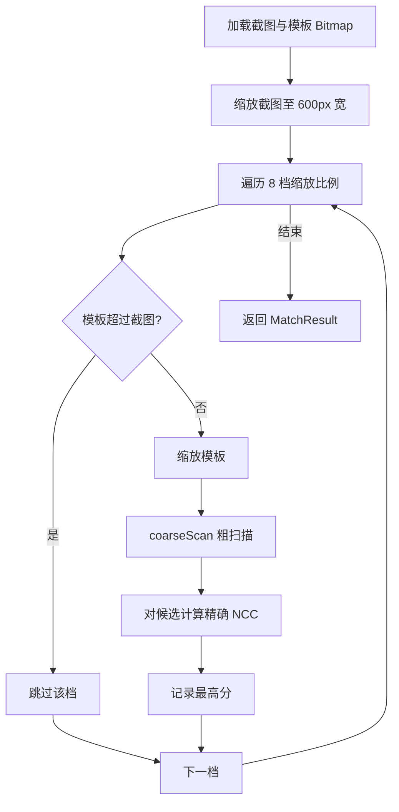

# 模板匹配

模板匹配是本应用的核心识别算法，它决定截图能否命中某个预置的门图案。

## 什么是模板匹配？

模板匹配是在一张较大图片（截图）中寻找一个较小模板图像（门图案）最佳出现位置的技术。本应用使用归一化互相关（NCC）作为相似度度量，NCC 分数越接近 1 表示越相似，可有效抵抗亮度与对比度变化。

**关键特征**:
- 多尺度：以 8 档缩放（0.35 至 1.8）应对模板在截图中大小不确定的问题
- 粗扫候选：步长 6px 的粗扫描快速筛选候选位置（阈值 0.35），再对候选做精确计算
- 阈值判定：最终匹配分数达到 0.45 才算命中

## 代码位置

| 方面 | 位置 |
|------|------|
| 匹配引擎 | `app/src/main/kotlin/com/example/screen_matcher/TemplateMatcher.kt` |
| 调用方 | `MainActivity.kt` 的 `handleScreenshot` |
| 结果类型 | `TemplateMatcher.MatchResult` |

## 核心常量

| 常量 | 值 | 含义 |
|------|-----|------|
| `NCC_THRESHOLD` | `0.45` | 最终判定命中的 NCC 阈值 |
| `COARSE_THRESHOLD` | `0.35` | 粗扫描候选保留阈值 |
| `MAX_SOURCE_WIDTH` | `600` | 截图缩放到的最大宽度 |
| `COARSE_STRIDE` | `6` | 粗扫描步长 |
| `SCALES` | `[0.35, 0.50, 0.65, 0.80, 1.0, 1.2, 1.5, 1.8]` | 缩放档位 |

## 不变量

1. **模板不得超过截图尺寸**: 缩放后的模板宽度/高度大于缩放截图时跳过该档位
2. **灰度值加权**: 像素灰度按 BT.601 权重计算（R*299 + G*587 + B*114）/ 1000
3. **低方差保护**: 分母过小（< 0.0001）时返回分数 0，避免除零

## 匹配流程

## 状态描述

匹配结果由 `MatchResult.matched` 表示：`nccScore >= NCC_THRESHOLD` 时为 `true`（命中），否则为 `false`。分数相同时取第一个遍历到的最高分模板（由于 `>` 严格大于判断，并列时保留先前记录）。
