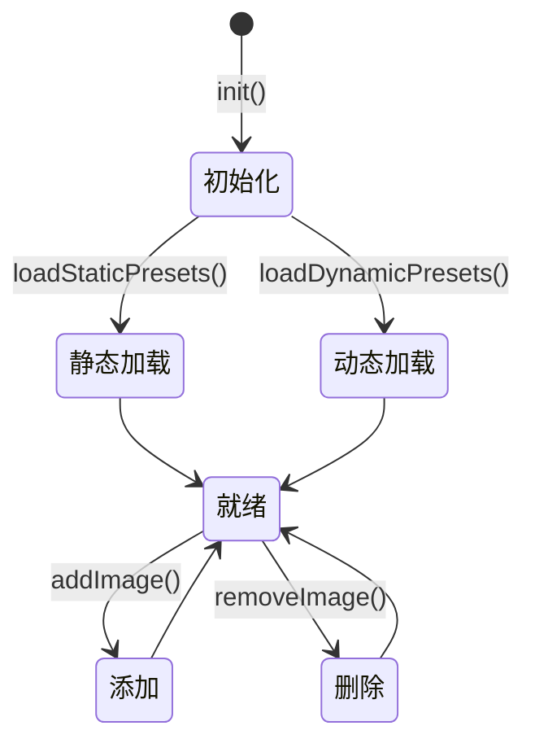

# 预置图片

预置图片是应用内置的「门」图案模板集合，是模板匹配的对象。

## 什么是预置图片？

预置图片是打包进 APK assets 目录的静态模板图片，以及用户通过文件选择器动态添加的自定义图片。两类图片统一由 PresetImageManager 管理，合并展示在主界面列表中。

**关键特征**:
- 静态预置：29 张「门」图案，首次启动从 assets 复制到应用私有目录（`filesDir/templates`）
- 动态添加：用户上传图片后复制到同一目录，并记录到 `dynamic_images.json` 清单
- 删除支持：仅动态图片可删除，静态预置不可删
- 命名避让：动态图片重名时自动追加 `_1`、`_2` 等后缀

## 代码位置

| 方面 | 位置 |
|------|------|
| 管理器 | `app/src/main/kotlin/com/example/screen_matcher/PresetImageManager.kt` |
| 静态资源 | `app/src/main/assets/preset_images/` |
| 资源清单 | `app/src/main/assets/preset_images/manifest.json` |
| 动态清单 | `filesDir/dynamic_images.json`（运行时生成） |
| 缓存目录 | `filesDir/templates/` |

## 图片分类

| 类别 | 来源 | 可删除 | 持久化方式 |
|------|------|--------|-----------|
| 静态预置 | assets | 否 | 打包在 APK 内 |
| 动态图片 | 用户上传 | 是 | `dynamic_images.json` |

## 不变量

1. **静态图片不可覆盖**: `addImage` 若与静态图片重名，自动改名而非覆盖
2. **清单同步**: 添加/删除动态图片后必须调用 `saveDynamicList()` 更新 JSON 清单
3. **目录持久化**: 图片最终都存放在应用私有目录，卸载应用即清空

## 生命周期

### 状态描述

| 状态 | 描述 |
|------|------|
| `初始化` | `cacheDir.mkdirs()` 准备缓存目录 |
| `静态加载` | 遍历 assets，按需复制到缓存目录 |
| `动态加载` | 读取 JSON 清单，登记存在的图片 |
| `就绪` | 内存缓存 `cachePaths` 完整，可提供查询 |

## 缩略图

主界面通过 `loadThumbnail(name)` 加载图片缩略图，使用 `inSampleSize = 4` 采样以减少内存占用。文件缺失或加载失败时返回 `null`，列表显示空白占位。
